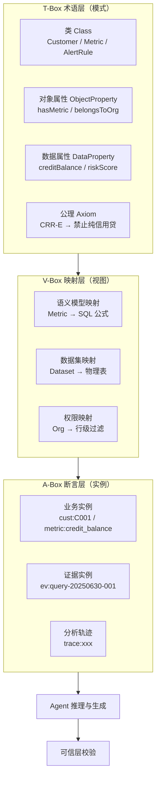
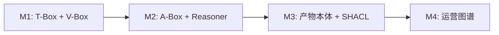

# 基于本体论的 AIP 技术规格与方案

> 在 [研发计划](RD_PLAN.md) 与 [技术方案](TECHNICAL_DESIGN.md) 之上，  
> 以**领域本体（Domain Ontology）**作为语义中枢，统一驱动数据、Agent、报告、可信与运营各模块的技术规格。

---

## 一、为什么用本体论

### 1.1 当前痛点

| 痛点 | 无本体时 | 有本体后 |
|------|----------|----------|
| 指标口径不一致 | 语义模型、知识库、Prompt 各写一套 | 指标定义唯一来源（T-Box） |
| 问数歧义 | LLM 自由理解「授信」「余额」 | 本体约束消歧 + 推理 |
| 证据不可追溯 | evidence 是松散 JSON | 证据指向本体实例 IRI |
| 规则难复用 | 预警/贷前规则散落在代码里 | 公理（Axioms）可声明、可版本化 |
| 跨场景难关联 | 贷前/贷后/营销数据割裂 | 客户-指标-信号-报告在同一图谱 |

### 1.2 本体论在 AIP 中的定位

```
传统做法：  数据表 → 语义模型 → Agent（弱约束）
本体驱动：  领域本体(T-Box) → 语义映射 → 知识图谱(A-Box) → Agent（强约束推理）
                ↑                      ↑
           指标/规则/流程           客户/授信/预警实例
```

**核心原则**：凡进入 Agent 上下文的概念，必须在本体中有明确定义或可推导。

---

## 二、本体三层架构（T-Box / A-Box / V-Box）



| 层级 | 内容 | 负责模块 | 里程碑 |
|------|------|----------|--------|
| **T-Box** | 类、属性、关系、公理、指标定义 | OntologyRegistry + SemanticModel | **M1** |
| **V-Box** | 本体概念 ↔ 物理数据/BI/API | DatasetRegistry + SemanticMapping | **M1** |
| **A-Box** | 客户/授信/预警等实例 + 证据 + Trace | KnowledgeGraph + TrustService | **M2** |

---

## 三、领域本体设计（AIP-Core Ontology）

### 3.1 命名空间与 IRI 规范

```
基础命名空间：
  https://{bank-domain}/ontology/aip#          → 类与属性（T-Box）
  https://{bank-domain}/data/aip/              → 实例（A-Box）
  https://{bank-domain}/vocab/aip/metric/      → 指标词表
  https://{bank-domain}/vocab/aip/dimension/   → 维度词表

IRI 示例：
  aip:Customer
  aip:Metric/credit_balance
  data:aip/customer/C001
  data:aip/evidence/ev-20250630-001
```

**技术规格要求**：所有 API 响应中的 `entity_id`、`metric_id`、`evidence.source` 必须使用合法 IRI 或 CURIE（如 `aip:Metric/credit_balance`）。

### 3.2 核心类层次（Class Hierarchy）

```
owl:Thing
├── BusinessEntity（业务实体）
│   ├── Customer（客户）
│   ├── Organization（机构）
│   ├── Product（产品）
│   └── Industry（行业）
├── DataAsset（数据资产）
│   ├── Dataset（数据集）
│   ├── SemanticModel（语义模型）
│   └── KnowledgeDocument（知识文档）
├── AnalyticsArtifact（分析产物）
│   ├── Metric（指标）
│   ├── Dimension（维度）
│   ├── QueryResult（查询结果）
│   ├── Chart（图表）
│   ├── Dashboard（看板）
│   └── Report（报告）
├── InsightArtifact（洞察产物）
│   ├── AnalysisTask（分析任务）
│   ├── Conclusion（结论）
│   ├── AttributionResult（归因结果）
│   └── ComparisonResult（对比结果）
├── Governance（治理）
│   ├── AlertRule（预警规则）
│   ├── AlertEvent（预警事件）
│   ├── BusinessRule（业务规则）
│   └── Evidence（证据）
└── Operations（运营）
    ├── ReportTemplate（报告模板）
    ├── AnalysisTemplate（分析模板）
    └── ReferenceCase（参考样例）
```

### 3.3 核心对象属性（Object Properties）

| 属性 IRI | 域 (domain) | 值域 (range) | 业务含义 |
|----------|-------------|--------------|----------|
| `hasMetric` | Dataset | Metric | 数据集包含指标 |
| `hasDimension` | Dataset | Dimension | 数据集包含维度 |
| `measuredOn` | Metric | BusinessEntity | 指标度量对象 |
| `derivedFrom` | Metric | Metric | 指标派生关系（销贷比←贷款+收入） |
| `belongsToOrg` | Customer | Organization | 客户归属机构 |
| `belongsToIndustry` | Customer | Industry | 客户所属行业 |
| `hasCRRLevel` | Customer | CRRLevel | 反洗钱等级 |
| `triggersAlert` | Metric / Event | AlertEvent | 触发预警 |
| `supportedBy` | Conclusion | Evidence | 结论证据支撑 |
| `generatedBy` | Conclusion | AnalysisTask | 结论生成任务 |
| `usesTemplate` | Report | ReportTemplate | 报告使用模板 |
| `containsChart` | Report / Dashboard | Chart | 包含图表 |
| `relatedTo` | Metric | Metric | 关联指标（推荐用） |
| `hasRelatedParty` | Customer | Customer | 关联企业 |

### 3.4 核心数据属性（Data Properties）

| 属性 | 域 | 类型 | 示例 |
|------|-----|------|------|
| `creditBalance` | Customer | decimal | 5800（万元） |
| `riskScore` | Customer | integer | 0-100 |
| `salesLoanRatio` | Customer | decimal | 0.72 |
| `revenueYoY` | Customer | decimal | -8.5（%） |
| `flowChangePct` | Customer | decimal | -32.5（%） |
| `formula` | Metric | string | SUM(credit_balance) |
| `timeWindow` | Metric | string | 报告期末 |
| `confidenceLevel` | Conclusion | enum | high/medium/low |

### 3.5 公理与业务规则（Axioms）— 本体推理基础

```turtle
# 示例（OWL/Turtle 表达）

aip:Customer a owl:Class .

aip:CRRLevel_E a aip:CRRLevel ;
    rdfs:label "极高风险"@zh .

aip:PureCreditProduct a aip:ProductRestriction .

# 公理：CRR 为 E 级的客户，禁止纯信用产品
aip:Customer a owl:Class ;
    rdfs:subClassOf [
        a owl:Restriction ;
        owl:onProperty aip:hasCRRLevel ;
        owl:hasValue aip:CRRLevel_E
    ] owl:complementOf aip:EligibleForPureCredit .

# 预警公理：流水变动 <= -20% → 橙色预警
aip:FlowDropAlert a aip:AlertRule ;
    aip:condition "flowChangePct <= -20" ;
    aip:level "橙色" ;
    aip:action "现场核查" .
```

**技术规格**：公理存储于 `OntologyRegistry`，运行时由 `RuleReasoner` 解释，**禁止**在 Agent Prompt 中硬编码与公理重复的业务约束。

---

## 四、本体驱动的技术规格体系

### 4.1 规格分层

```
L0  本体规格（Ontology Spec）     → 类/属性/公理 IRIs
L1  语义映射规格（Mapping Spec）  → 本体 ↔ SQL/BI 字段
L2  服务接口规格（API Spec）      → OpenAPI，实体引用 IRI
L3  Agent 工具规格（Tool Spec）   → function schema 参数对齐本体
L4  产物规格（Artifact Spec）    → Report/Chart/Evidence JSON-LD
```

### 4.2 L0 本体规格 — 交付物

| 交付物 | 格式 | 维护方 | 里程碑 |
|--------|------|--------|--------|
| `aip_core.owl` | OWL 2 DL | 业务+数据架构 | M1 |
| `aip_core.ttl` | Turtle 序列化 | 同上 | M1 |
| `aip_vocab.yaml` | 指标/维度/枚举词表 | 数据产品 | M1 |
| `aip_axioms.yaml` | 预警/贷前/合规公理 | 风控+合规 | M1 |

仓库起步文件：`demo/data/ontology/aip_core.yaml`

### 4.3 L1 语义映射规格

每个 `Metric` 和 `Dimension` 必须有映射文档：

```yaml
# mapping spec 示例
iri: aip:Metric/credit_balance
label: 授信余额
formula: "SUM(credit_balance)"
bindings:
  - dataset: aip:Dataset/customer_360
    table: customer_credit
    column: credit_balance
permissions:
  row_filter: "org_id IN (${user.orgs})"
ontology_links:
  derivedFrom: []
  relatedTo:
    - aip:Metric/risk_score
    - aip:Metric/sales_loan_ratio
```

**DoD（M1）**：P0 场景涉及的 50+ 指标/维度 100% 有 IRI + 映射 + 至少一条 `relatedTo`。

### 4.4 L2 API 规格 — 本体对齐的接口契约

所有核心 API 响应采用 **JSON-LD** 或带 `@context` 的 JSON：

```json
{
  "@context": "https://bank.example.com/ontology/aip/context.jsonld",
  "@type": "aip:QueryResult",
  "@id": "data:aip/query-result/qr-001",
  "aip:metric": { "@id": "aip:Metric/credit_balance" },
  "aip:measuredOn": { "@id": "data:aip/customer/C002" },
  "aip:timePeriod": "2025-06",
  "aip:rows": [{"aip:region": "华南", "aip:creditBalance": 3200}],
  "aip:supportedBy": [
    { "@id": "data:aip/evidence/ev-001", "@type": "aip:Evidence" }
  ]
}
```

| API | 本体锚点 | 规格要点 |
|-----|----------|----------|
| `POST /api/ask` | QueryResult, Conclusion, Evidence | 返回 metric IRI + evidence IRI |
| `GET /ontology/metrics/{iri}` | Metric | 口径解释标准接口 |
| `POST /api/research` | AnalysisTask, Conclusion | TaskGraph 节点引用本体类 |
| `POST /api/report` | Report, ReportTemplate | 模板槽位绑定 Metric/Chart IRI |
| `GET /api/alerts` | AlertEvent, AlertRule | 预警关联规则 IRI |
| `GET /api/trace/{id}` | AnalysisTask 步骤链 | 每步输入输出实体 IRI |

### 4.5 L3 Agent 工具规格 — 本体类型约束

每个 Tool 的 JSON Schema 参数必须引用本体类：

```json
{
  "name": "semantic_query",
  "description": "基于本体约束的语义查数",
  "parameters": {
    "type": "object",
    "properties": {
      "metric_iri": {
        "type": "string",
        "format": "iri",
        "enum_ref": "aip:Metric/*"
      },
      "dimension_iri": { "type": "string", "format": "iri" },
      "entity_iri": {
        "type": "string",
        "format": "iri",
        "class": "aip:Customer"
      },
      "time_period": { "type": "string", "pattern": "^\\d{4}-\\d{2}$" }
    },
    "required": ["metric_iri"]
  }
}
```

**Agent 工具清单与本体映射**：

| Tool | 输入本体类 | 输出本体类 |
|------|------------|------------|
| `semantic_query` | Metric, Dimension, Customer | QueryResult |
| `explain_metric` | Metric | KnowledgeDocument |
| `dimension_attribution` | Metric, Dimension | AttributionResult |
| `compare_entities` | Customer, Metric | ComparisonResult |
| `generate_chart` | QueryResult | Chart |
| `generate_dashboard` | Dashboard, Metric[] | Dashboard |
| `compose_report_section` | ReportTemplate, QueryResult | Report |
| `evaluate_alert_rules` | Customer, AlertRule | AlertEvent[] |
| `cite_evidence` | Conclusion, Evidence | Conclusion |

### 4.6 L4 产物规格 — 结论与证据

```json
{
  "@type": "aip:Conclusion",
  "aip:text": "天宇建筑流水同比下降32.5%，触发橙色预警",
  "aip:confidenceLevel": "aip:ConfidenceHigh",
  "aip:limitations": ["aip:Limitation/small_sample"],
  "aip:supportedBy": [
    {
      "@type": "aip:Evidence",
      "@id": "data:aip/evidence/ev-001",
      "aip:evidenceType": "aip:EvidenceType/query",
      "aip:source": "aip:Dataset/transaction_flow",
      "aip:metric": "aip:Metric/flow_change_pct",
      "aip:timePeriod": "2025-06",
      "aip:derivation": "SELECT ... FROM transaction_flow WHERE ..."
    }
  ]
}
```

**可信层规格（7.x）**：`TrustService.validate()` 输入输出均为本体实例；质检规则表达为 SPARQL ASK 查询或 SHACL 形状约束。

---

## 五、本体与各模块实现方案

### 5.1 模块映射总表

| 研发模块 | 本体角色 | 实现组件 | 里程碑 |
|----------|----------|----------|--------|
| DatasetRegistry | V-Box 物理绑定 | `PhysicalBinding` 存表/列↔IRI | M1 |
| SemanticModelCenter | T-Box 指标/维度 | 从 OWL 导入或导出 | M1 |
| OntologyRegistry | T-Box 管理 | OWL 解析、版本、diff | M1 |
| KnowledgeGraph | A-Box 存储 | Neo4j / RDF Store | M2 |
| QueryAgent | A-Box 查询 + T-Box 约束 | SPARQL/语义SQL 双通道 | M2 |
| KnowledgeEngine | T-Box 文档类 | 知识条目 `aip:KnowledgeDocument` | M2 |
| RuleReasoner | 公理执行 | OWL Reasoner / 自定义规则 | M2 |
| DeepResearchAgent | 任务本体编排 | TaskGraph 节点 = 本体类实例 | M2 |
| ReportComposer | 模板槽位本体化 | Slot → Metric/Chart IRI | M3 |
| AlertEngine | 公理实例化 | AlertRule ⊂ T-Box | M3 |
| TrustLayer | 证据本体校验 | SHACL / SPARQL ASK | M1→M3 |
| AssetCenter | 模板/案例本体 | AnalysisTemplate ⊂ T-Box | M4 |

### 5.2 新增核心服务：OntologyRegistry

```
aip/ontology/
├── registry.py      # OWL/YAML 加载、版本管理
├── schema.py        # Pydantic 本体模型（与 JSON-LD 互转）
├── mapper.py        # T-Box ↔ SemanticModel 双向同步
├── reasoner.py      # 公理/预警/合规推理
├── graph.py         # A-Box 知识图谱 CRUD
└── shacl/           # SHACL 形状约束（可信质检）
```

**M1 交付**：
- [ ] `OntologyRegistry` 加载 `aip_core.yaml` / `aip_core.owl`
- [ ] `SemanticModelCenter` 从本体同步 Metric/Dimension
- [ ] 指标 IRI 在全平台统一

**M2 交付**：
- [ ] `KnowledgeGraph` 写入客户/预警实例
- [ ] `QueryAgent` Text2SQL 注入本体 DDL（语义 DDL = T-Box 摘要）
- [ ] `RuleReasoner` 执行贷前路径公理

### 5.3 问数链路的本体化改造

```
用户问句
  → [NLU] 实体链接（EL）→ 本体实例 IRI（客户/指标/机构）
  → [QueryPlanner] 查 T-Box 获取 Metric.formula + Dimension.hierarchy
  → [SQLGenerator] 基于 V-Box 映射生成 SQL（非自由生成）
  → [Executor] 执行 → 结果挂接 QueryResult 个体
  → [ConclusionGenerator] 生成 Conclusion，自动创建 Evidence 个体
  → [TrustService] SHACL 校验数字/口径/证据完整性
```

**语义 DDL 示例**（注入 LLM 的并非裸表结构，而是本体摘要）：

```
Class: aip:Customer
  Properties: creditBalance, riskScore, hasCRRLevel, belongsToOrg
Class: aip:Metric/credit_balance
  Formula: SUM(credit_balance)
  Unit: 万元
  Related: risk_score, sales_loan_ratio
Restriction: CRRLevel_E → not EligibleForPureCredit
```

### 5.4 报告模板的本体化槽位

```yaml
# ReportTemplate 本体规格
iri: aip:ReportTemplate/marketing_onepager
slots:
  - id: profile_summary
    type: aip:Conclusion
    required_metrics:
      - aip:Metric/credit_balance
      - aip:Metric/cooperation_years
  - id: product_recommendation
    type: aip:ActionItem
    constrained_by: aip:BusinessRule/product_eligibility
  - id: trend_chart
    type: aip:Chart
    chart_of: aip:Metric/credit_balance
    chart_type: aip:ChartType/line
variables:
  - aip:Customer  # 报告期主体
  - aip:Organization  # 机构变量
```

---

## 六、与研发里程碑的对齐（本体视角）

| 里程碑 | 本体交付 | 驱动功能 |
|--------|----------|----------|
| **M1** | T-Box v1.0 + V-Box 映射 + SHACL 基础形状 | 0.1, 0.2, 7.2, 7.3 |
| **M2** | A-Box 图谱 + RuleReasoner + 语义 DDL | 1.x, 2.x, 3.x, 5.x, 7.4, 7.5 |
| **M3** | 报告/预警槽位本体化 + 完整 SHACL 质检 | 4.x, 6.x, 7.1 |
| **M4** | 模板/案例图谱 + 关联推荐推理 | 1.4, 8.x |



---

## 七、34 条场景的本体模式（Ontology Pattern）

| 场景 | 本体模式 | 核心类/关系 |
|------|----------|-------------|
| 0.1 数据接入 | **DataAsset Pattern** | Dataset, hasMetric, PhysicalBinding |
| 0.2 语义配置 | **Metric Definition Pattern** | Metric, derivedFrom, formula |
| 1.1 问数 | **Analytical Query Pattern** | Metric, measuredOn, QueryResult |
| 1.2 多轮追问 | **Contextual Analysis Pattern** | QueryResult, follows, drillDown |
| 1.3 口径解释 | **Definition Pattern** | Metric, KnowledgeDocument |
| 2.1 看板 | **Dashboard Pattern** | Dashboard, containsChart, filtersOn |
| 5.3 归因 | **Attribution Pattern** | AttributionResult, contributesTo |
| 5.4 对比 | **Comparison Pattern** | ComparisonResult, compares, benchmark |
| 6.1 预警 | **Event-Condition-Action Pattern** | AlertRule, triggersAlert, AlertEvent |
| 4.6 报告 | **Document Composition Pattern** | Report, usesTemplate, supportedBy |
| 7.3 证据 | **Provenance Pattern** | Conclusion, supportedBy, Evidence |
| 贷前筛查（组合） | **Risk Screening Pattern** | Customer, hasCRRLevel, triggersAlert, BusinessRule |

---

## 八、技术选型（本体层）

| 组件 | 推荐 | 用途 |
|------|------|------|
| 本体建模 | Protégé + OWL 2 DL | T-Box 编辑与推理验证 |
| 序列化 | Turtle / RDF/XML / JSON-LD | 交换与 API |
| 轻量运行时 | YAML + Pydantic（M1 过渡） | 快速落地，后迁 OWL |
| 图数据库 | Neo4j（属性图）或 Apache Jena（RDF） | A-Box 存储 |
| 推理机 | OWLready2 / Pellet / 自研规则引擎 | 公理执行 |
| 约束校验 | SHACL | 可信质检（7.1） |
| 实体链接 | 自研 + Embedding | NL → IRI |
| 向量检索 | Metric/Document 个体 Embedding | 元数据 + 知识召回 |

**M1 务实策略**：T-Box 用 `aip_core.yaml` + Pydantic 校验；M2 迁移 OWL；M3 引入 SHACL 质检。

---

## 九、本体驱动的研发流程

```
1. 业务场景入库 → 识别本体模式（Pattern）
2. 扩展 T-Box   → 新增类/属性/公理（需评审）
3. 建立 V-Box   → 数据集字段映射到 IRI
4. 编写 SHACL  → 定义产物约束形状
5. 生成 API/Tool Spec → 从本体自动导出 JSON Schema
6. 实现服务     → Agent 仅操作本体许可的类型
7. 评测         → 基于本体的 SPARQL 断言验证结果
```

**规格评审门禁**：新增 P0 功能必须先有本体变更单（Ontology Change Request, OCR）。

---

## 十、示例：贷前筛查场景端到端

```
1. 上传名单 → 实例化 aip:Customer（临时个体）
2. 多源扫描 → 挂接 creditBalance, riskScore, hasCRRLevel
3. 规则推理 → RuleReasoner:
     C002: hasCRRLevel=C, legal_cases>=2 → triggersAlert(司法预警)
     C004: hasCRRLevel=D → 推理结论 NotEligibleForPureCredit
4. 归因     → AttributionResult on riskScore by Industry
5. 结论     → aip:Conclusion + supportedBy Evidence*
6. 报告     → Report usesTemplate aip:ReportTemplate/risk_screening
7. 质检     → SHACL: 结论必有 >=1 Evidence；数字与 QueryResult 一致
```

---

## 十一、与现有 MVP 的衔接

| MVP 组件 | 本体化改造 |
|----------|------------|
| `semantic/model.py` MetricDef | 增加 `iri`, `derivedFrom`, `relatedTo` 字段 |
| `models.py` EvidenceRef | 改为 JSON-LD `aip:Evidence` |
| `query_agent.py` | SQL 生成前查 OntologyRegistry |
| `alert/rules.py` | 规则迁移为 `aip:AlertRule` 个体 |
| `trust/layer.py` | 增加 SHACL 校验钩子 |
| `scenario_registry.yaml` | 每场景增加 `ontology_pattern` 字段 |

---

## 十二、下一步行动项

| 序号 | 行动 | 负责 | 里程碑 |
|------|------|------|--------|
| 1 | 评审 `aip_core.yaml` 类/属性清单 | 业务+架构 | M1 启动 |
| 2 | 建立 OCR 流程与版本规范 | 平台组 | M1 |
| 3 | 50 个 P0 指标 IRI 登记 | 数据产品 | M1 |
| 4 | API 响应增加 `@context` | 后端 | M1 |
| 5 | QueryAgent 语义 DDL 改造 | Agent 组 | M2 |
| 6 | SHACL 形状库 v1 | 可信组 | M3 |

相关文件：
- 本体起步：`demo/data/ontology/aip_core.yaml`
-  pydantic 模型：`aip/ontology/schema.py`
