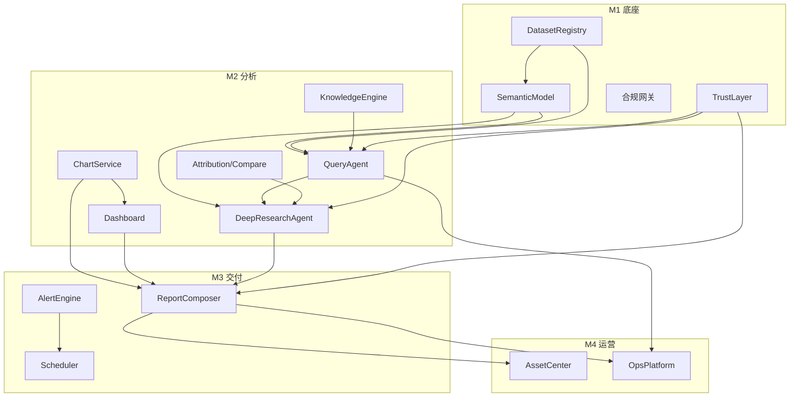

# AIP 智能分析平台研发计划

> 基于 34 条业务能力场景，结合当前 MVP 完成度制定。  
> 时间以**技术里程碑**表述，不绑定具体日历日期。

---

## 一、总体策略

### 1.1 建设原则

1. **语义层先行**：语义模型未就绪前，不开放生产问数
2. **本体驱动**：T-Box（术语）→ V-Box（映射）→ A-Box（实例）三层本体架构，Agent 仅操作本体许可类型（详见 [ONTOLOGY_SPEC.md](ONTOLOGY_SPEC.md)）
3. **主链路优先**：数据准备 → 问数 → 图表/洞察 → 报告 → 可信约束
3. **Agent 分工**：QueryAgent（单轮）/ DeepResearchAgent（多步）/ ReportOrchestrator（模板）职责不交叉
4. **可信贯穿**：P0 功能必须同步交付证据链，不允许「先上线后补可信」
5. **模板化运营**：高频场景走模板沉淀，开放性问题走深度研究

### 1.2 分期总览

| 阶段 | 目标 | 覆盖能力 | 前置依赖 |
|------|------|----------|----------|
| **M0（已完成）** | MVP 可演示 | 34 场景 Demo + 规则引擎骨架 | 无 |
| **M1** | 生产底座 | 数据准备 + 语义模型 + 可信层 | 行内数仓/BI 对接方案确认 |
| **M2** | 核心分析链路 | 问数 + 图表 + 洞察 + 看板 | M1 |
| **M3** | 报告与运营 | 报告编排 + 预警 + 沉淀 + 运营监测 | M2 |
| **M4** | 增强与规模化 | P1 能力 + 性能/合规/多租户 | M3 |

```mermaid
gantt
    title AIP 研发里程碑依赖
    dateFormat X
    axisFormat %s

    section 底座
    M0_MVP           :done, m0, 0, 1
    M1_数据语义可信   :m1, 1, 3

    section 分析
    M2_问数图表洞察   :m2, 3, 5

    section 交付
    M3_报告预警沉淀   :m3, 5, 7

    section 增强
    M4_P1与规模化     :m4, 7, 9
```

---

## 二、功能优先级矩阵（P0 / P1 / 延后）

### 2.1 数据准备类

| ID | 功能 | 优先级 | 里程碑 | MVP 状态 | 生产目标 |
|----|------|--------|--------|----------|----------|
| 0.1 | 数据集接入与配置 | **P0** | M1 | 演示级（CSV+DuckDB） | 库表/BI 直连、增量同步、DataAgent 向量化、敏感字段分级 |
| 0.2 | 语义模型与指标配置 | **P0** | M1 | YAML 配置 | 可视化配置台、指标公式校验、权限绑定、版本管理 |
| 0.3 | 分析脚本编写与编辑 | **P0** | M2 | 基础 SQL/Python 沙箱 | Notebook UI、审计留痕、资源配额、结果持久化 |

### 2.2 问数类

| ID | 功能 | 优先级 | 里程碑 | MVP 状态 | 生产目标 |
|----|------|--------|--------|----------|----------|
| 1.1 | 智能问数与知识问答 | **P0** | M2 | 规则 Text2SQL + 关键词 RAG | LLM Text2SQL、混合检索 RAG、多数据集联邦查询 |
| 1.2 | 多轮追问分析 | **P0** | M2 | 会话上下文 + 规则路由 | 意图继承、result_ref 引用、追问推荐模型 |
| 1.3 | 指标口径解释 | **P0** | M2 | 语义元数据召回 | 元数据 + 知识库双路召回、指标小结运营配置 |
| 1.4 | 关联指标推荐 | **P1** | M4 | 语义模型关联图 | 图谱推荐 + 行为协同过滤 |

### 2.3 看板类

| ID | 功能 | 优先级 | 里程碑 | MVP 状态 | 生产目标 |
|----|------|--------|--------|----------|----------|
| 2.1 | Dashboard 设计与接入 | **P0** | M2 | Jinja2 静态 HTML | 模板引擎 + API 刷新 + BI 图表嵌入 |
| 2.2 | Dashboard 解读 | **P0** | M2 | 规则化文字 | LLM 解读 + 异动检测联动 |
| 2.3 | 数据下钻分析 | **P0** | M2 | 4 层静态下钻 | 交互式 DrillDown API + 归因联动 |

### 2.4 图表类

| ID | 功能 | 优先级 | 里程碑 | MVP 状态 | 生产目标 |
|----|------|--------|--------|----------|----------|
| 3.1 | 图表设计 | **P0** | M2 | 规则映射 | 意图→图表 Planner（LLM + 规则） |
| 3.2 | 图表生成 | **P0** | M2 | Plotly 5 类图 | 扩展图表库 + 导出 PNG/SVG |
| 3.3 | 图表解读 | **P0** | M2 | 模板化描述 | 数据摘要 + LLM 业务解读 |

### 2.5 报告类

| ID | 功能 | 优先级 | 里程碑 | MVP 状态 | 生产目标 |
|----|------|--------|--------|----------|----------|
| 4.1 | 可复用报告框架定义 | **P0** | M3 | 7 套 HTML 模板 | 拖拽配置台 + docx/PDF 导出 |
| 4.2 | 单次报告大纲规划 | **P0** | M3 | DeepResearch 规划 | 用户确认/调整大纲交互 |
| 4.3 | 周期报告自动编排 | **P0** | M3 | 手动触发 | Cron 调度 + 推送 + 归档 |
| 4.4 | 报告变量化生成 | **P1** | M4 | 2 变量演示 | 批量参数化 + 任务队列 |
| 4.5 | 多受众版本生成 | **P1** | M4 | 3 套 Prompt 差异 | 角色模板 + 审批流 |
| 4.6 | 报告生成 | **P0** | M3 | HTML 报告 | 嵌入 BI 原图 + 口径脚注 + 质检门禁 |

### 2.6 洞察类

| ID | 功能 | 优先级 | 里程碑 | MVP 状态 | 生产目标 |
|----|------|--------|--------|----------|----------|
| 5.1 | 分析任务规划 | **P0** | M2 | 固定 4 步 TaskGraph | 动态规划 + 人工确认节点 |
| 5.2 | 综合洞察归纳 | **P0** | M2 | 规则归纳 | LLM 融合多源 + 规则约束 |
| 5.3 | 指标波动归因 | **P0** | M2 | 维度归因 | 维度归因 + 公式分解 + SHAP |
| 5.4 | 多维对比分析 | **P0** | M2 | 单维对比 | 同比/环比/对标多模式 |

### 2.7 预警建议类

| ID | 功能 | 优先级 | 里程碑 | MVP 状态 | 生产目标 |
|----|------|--------|--------|----------|----------|
| 6.1 | 数据预警设计 | **P0** | M3 | YAML 规则 | 规则配置台 + 误触反馈闭环 |
| 6.2 | 业务建议生成 | **P0** | M3 | 模板建议 | 规则库约束 + LLM 生成 action items |

### 2.8 可信类（横切，全部 P0）

| ID | 功能 | 优先级 | 里程碑 | MVP 状态 | 生产目标 |
|----|------|--------|--------|----------|----------|
| 7.1 | 分析结果质检 | **P0** | M1→M3 渐进 | 基础校验 | 数字一致性 + 口径交叉 + 评测集 |
| 7.2 | 受控生成与事实约束 | **P0** | M1 | 无证据降置信 | Prompt 护栏 + 拒绝策略 + 规则库约束 |
| 7.3 | 证据引用 | **P0** | M1 | evidence_refs | 可点击溯源 + 口径脚注 |
| 7.4 | 分析过程回溯 | **P0** | M2 | 内存 Trace | OpenTelemetry 全链路 + 审计存储 |
| 7.5 | 缺失/低置信标注 | **P0** | M2 | limitations 字段 | 自动检测 + UI 显式标签 |

### 2.9 沉淀类

| ID | 功能 | 优先级 | 里程碑 | MVP 状态 | 生产目标 |
|----|------|--------|--------|----------|----------|
| 8.1 | 分析模板沉淀 | **P1** | M4 | 内存收藏 | 持久化 + 标签 + 搜索 |
| 8.2 | 报告模板运营 | **P1** | M4 | 版本记录 | 发布/灰度/订阅/推送 |
| 8.3 | 参考结果沉淀 | **P1** | M4 | 案例库 Demo | 高分报告召回 + 叙事对齐 |
| 8.4 | 分析产品运营监测 | **P1** | M4 | 模拟指标 | Trace 埋点 + 运营看板 + 评测闭环 |

### 2.10 延后项（M4 之后或视业务裁剪）

| 功能 | 延后原因 | 触发条件 |
|------|----------|----------|
| 实时流式数据同步 | 基础设施复杂度高 | 风控实时场景明确需求 |
| 多租户 SaaS 化 | 当前面向行内私有化 | 跨分行独立运营需求 |
| 联网搜索补充 | 合规审批周期长 | 外部信息引入获批 |
| 归因 ML 模型（XGBoost+SHAP） | 需历史样本积累 | 异动分析样本 > 10万条 |
| 语音/移动端问数 | 非核心场景 | 一线明确诉求 |

---

## 三、模块研发计划与完成标准

### 3.1 M1：生产底座

| 模块 | 研发内容 | 完成标准（DoD） | 依赖 |
|------|----------|-----------------|------|
| **OntologyRegistry** | T-Box v1.0（类/属性/公理/指标词表）；OCR 流程 | `aip_core.owl` 评审通过；50+ 指标 IRI 登记 | 业务+架构评审 |
| **DatasetRegistry** | 对接行内数仓（Hive/ClickHouse）、BI 数据集 API；增量同步任务 | 3 类数据源接入成功；V-Box 映射 100% 覆盖 P0 指标 | 数据源账号、OntologyRegistry |
| **DataAgentProfile** | 元数据向量化、样本值索引、字段画像 | 问数召回准确率评测 ≥ 85%（内部评测集） | 向量库、Embedding 服务 |
| **SemanticModelCenter** | 配置台 CRUD、公式校验、数据集绑定 | 50+ 指标可配置；口径解释一致性 100% | M1 DatasetRegistry |
| **TrustLayer（基础）** | 证据引用规范、受控生成 Prompt、无数据拒绝 | 所有 P0 接口返回 evidence_refs | 无 |
| **合规网关** | 敏感字段分级、外传策略、脱敏 | 高敏字段零外传（自动化扫描验证） | 安全评审 |

### 3.2 M2：核心分析链路

| 模块 | 研发内容 | 完成标准（DoD） | 依赖 |
|------|----------|-----------------|------|
| **QueryAgent** | LLM Text2SQL、多数据集路由、权限注入 | 问数成功率 ≥ 80%（业务评测集 200 条） | M1 语义层 + LLM |
| **KnowledgeEngine** | 向量 RAG、混合检索、引用溯源 | 知识问答准确率 ≥ 85% | 企业知识引擎 |
| **ConversationContext** | 多轮状态持久化、result_ref | 3 轮以上追问无需重复背景 | QueryAgent |
| **AttributionEngine** | 维度归因 + 公式因子分解 | 与业务专家标注一致率 ≥ 70% | 语义模型指标公式 |
| **CompareEngine** | 同比/环比/对标多模式 | 覆盖 5 种对比意图 | 时间维预置 |
| **ChartService** | Planner + Renderer + Interpret | 5 类图 < 3s 渲染；解读含数据依据 | 查询结果 |
| **DashboardGenerator** | 可交互 HTML + 筛选 API + BI 嵌入 | 筛选联动刷新 < 5s | ChartService |
| **DeepResearchAgent** | 动态 TaskGraph、子任务执行、人工确认 | 开放问题端到端成功率 ≥ 70% | 全部 M2 工具 |
| **Trace** | OpenTelemetry 接入 | 单次分析 ≥ 12 步可追溯 | 日志平台 |

### 3.3 M3：报告与运营

| 模块 | 研发内容 | 完成标准（DoD） | 依赖 |
|------|----------|-----------------|------|
| **ReportTemplateAsset** | 配置台、7+ 模板、docx/PDF 导出 | 四类营销材料模板可用 | M2 图表 |
| **ReportComposer** | 大纲确认、模块编排、BI 原图嵌入 | 报告数字与源系统一致率 100% | Dashboard + Trust |
| **ReportScheduler** | Cron、推送、归档 | 日/周报无人值守生成 | 消息通道 |
| **AlertEngine** | 规则配置台、误触反馈、闭环 | 预警误触率可监测可迭代 | 异动检测 |
| **SuggestionEngine** | 规则库 + LLM 建议 | 产品限制建议 100% 来自规则库 | 规则库 |
| **TrustLayer（完整）** | 报告质检、数字交叉校验 | 报告提交前质检通过率 ≥ 95% | 评测集 |

### 3.4 M4：增强与规模化

| 模块 | 研发内容 | 完成标准（DoD） |
|------|----------|-----------------|
| **AssetCenter** | 持久化收藏、模板运营、参考案例 | 模板复用率可统计 |
| **OpsPlatform** | 成功率/采纳率/修改率看板 | 驱动月度迭代 |
| **变量化/多受众报告** | 批量生成 + 角色模板 | 单次批量 ≥ 100 份 |
| **关联指标推荐** | 图谱 + 行为推荐 | Top5 推荐点击率可测 |

---

## 四、模块依赖关系

**关键路径**：`DatasetRegistry → SemanticModel → QueryAgent → DeepResearchAgent → ReportComposer → TrustLayer`

---

## 五、团队分工建议

| 小组 | 负责模块 | 里程碑 |
|------|----------|--------|
| 数据平台组 | DatasetRegistry、DataAgent、语义模型配置台 | M1 |
| Agent 组 | QueryAgent、DeepResearchAgent、Prompt 工程 | M2 |
| 分析引擎组 | 归因、对比、预警、Chart、Dashboard | M2 |
| 报告组 | 模板、编排、调度、导出 | M3 |
| 平台/可信组 | TrustLayer、Trace、合规、运营监测 | M1→M4 横切 |
| 业务产品组 | 场景评测集、模板内容、规则库 | 全程 |

---

## 六、风险与缓解

| 风险 | 影响 | 缓解措施 |
|------|------|----------|
| 语义模型覆盖不足 | 问数准确率低 | M1 优先落地 3 大主题（贷前/贷后/营销） |
| 敏感数据外传 | 合规风险 | M1 同步交付合规网关，默认最小外传 |
| LLM 幻觉 | 结论不可信 | 7.2/7.3 与 QueryAgent 同步上线，无证据不输出强结论 |
| 报告数字不一致 | 业务质疑 | 嵌入 BI 原图 + 质检门禁 |
| 归因算法不准 | 洞察价值低 | 先维度归因（可解释），ML 归因延后 |

---

## 七、P0 功能交付清单（按里程碑）

### M1 必须交付
- [ ] 0.1 数据集接入（库表 + BI + 文件）
- [ ] 0.2 语义模型配置台
- [ ] 7.2 受控生成
- [ ] 7.3 证据引用

### M2 必须交付
- [ ] 1.1~1.3 问数全链路
- [ ] 1.2 多轮追问
- [ ] 2.1~2.3 看板全链路
- [ ] 3.1~3.3 图表全链路
- [ ] 5.1~5.4 洞察全链路
- [ ] 0.3 脚本 Workbench
- [ ] 7.4~7.5 回溯与低置信

### M3 必须交付
- [ ] 4.1~4.3、4.6 报告全链路
- [ ] 6.1~6.2 预警与建议
- [ ] 7.1 完整质检

### M4 交付（P1）
- [ ] 1.4、4.4、4.5
- [ ] 8.1~8.4 沉淀与运营
