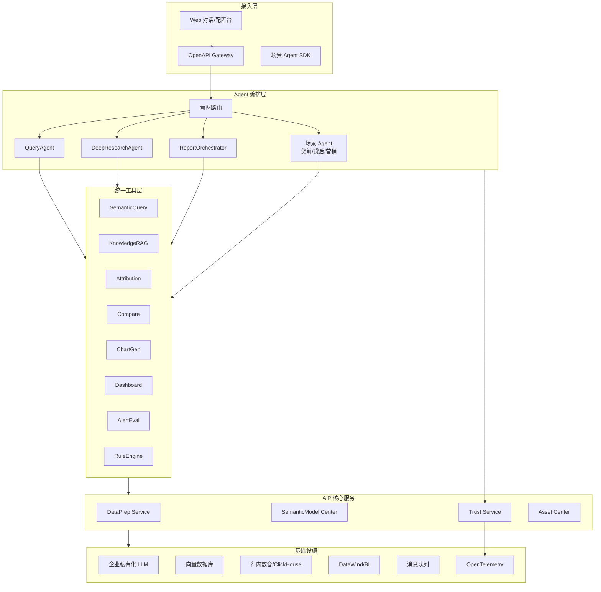
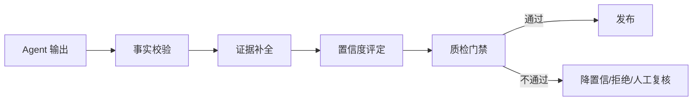

# AIP 智能分析平台技术方案

> 各模块实现思路、关键技术选型与依赖关系。  
> 当前仓库 MVP 已实现演示骨架，本文描述生产级目标架构。

---

## 一、总体架构



### 1.1 与 MVP 的差距

| 维度 | MVP（当前仓库） | 生产目标 |
|------|-----------------|----------|
| 查询引擎 | DuckDB 内存 | 行内数仓 + 查询加速层 |
| Text2SQL | 规则匹配 | LLM + 语义层 + 自愈重试 |
| 知识问答 | 关键词匹配 | 向量 RAG + 重排序 |
| 看板 | 静态 HTML | 模板 + API 动态刷新 + BI 嵌入 |
| 可信 | 内存 Trace | OTel + 审计库 + 质检评测 |
| 部署 | 单机 Python | K8s 微服务 +  Helm |

---

## 二、分模块技术方案

### 2.0 数据准备类

#### 0.1 数据集接入与配置 — `DataPrep Service`

**实现思路**

```
数据源适配器（Adapter 模式）
├── WarehouseAdapter   → Hive/ClickHouse JDBC
├── BIAdapter          → DataWind API / 仪表盘绑定
├── FileAdapter        → Excel/CSV 解析（会话级）
└── SyncScheduler      → 全量/增量/实时 CDC

DataAgent 分析能力
├── 元数据采集 → Schema + 统计画像
├── 向量化     → 表名/字段名/维值 Embedding
├── 样本索引   → 高频维值 Top-N
└── 合规标记   → 敏感字段分级标签
```

**技术选型**

| 组件 | 选型 | 说明 |
|------|------|------|
| 查询加速 | ClickHouse / ByteHouse | 大宽表聚合 |
| 元数据 | OpenMetadata / 自研 | 与语义层同步 |
| 向量库 | Milvus / Elasticsearch | 元数据检索 |
| 文件解析 | Pandas + openpyxl | 多 Sheet、类型推断 |
| 同步调度 | Apache DolphinScheduler / Airflow | 全量/增量任务 |
| 会话临时表 | DuckDB / 内存表 | 当次上传不固化 |

**关键依赖**：数仓账号、BI OpenAPI、Embedding 服务、合规字段清单

**MVP 代码锚点**：`aip/data_prep/dataset_registry.py`、`session_upload.py`

---

#### 0.2 语义模型与指标配置 — `SemanticModel Center`

**实现思路**

```yaml
# 语义模型 DSL（扩展当前 YAML）
SemanticModel:
  metrics:
    - id: sales_loan_ratio
      formula: "loan_balance / revenue"    # SQL 表达式
      filters: ["report_date = '{period}'"]
      permissions: { row_filter: "org_id IN ({user_orgs})" }
      relations: [credit_balance, revenue_yoy]
  dimensions:
    - hierarchy: [region, branch, manager]  # 下钻层级
```

- **配置台**：React 表单 + 公式编辑器（Monaco）+ 实时 SQL 预览
- **公式校验**：AST 解析 → 生成 SQL → 在样本数据上试跑
- **口径文档**：关联企业知识引擎条目，支持版本 diff

**技术选型**

| 组件 | 选型 |
|------|------|
| 配置存储 | PostgreSQL + Git 版本 |
| 公式解析 | sqlglot / ANTLR |
| 权限 | 对接行内 IAM + 行级过滤注入 |

**MVP 代码锚点**：`aip/semantic/model.py`

---

#### 0.3 分析脚本 Workbench — `ScriptWorkbench`

**实现思路**

- 前端：JupyterLab 定制 / Monaco Notebook 组件
- 后端：隔离沙箱（gVisor / Firecracker）执行 Python；SQL 走只读账号
- 审计：每次执行记录代码、数据范围、操作人
- 与 Agent 互通：Agent 生成脚本 → 用户「展开编辑」→ 再执行

**技术选型**

| 组件 | 选型 |
|------|------|
| Python 沙箱 | Jupyter Kernel Gateway + 资源限制 |
| SQL 执行 | 只读 Role + 超时 30s + 行数上限 |
| 结果缓存 | Redis（会话级） |

**MVP 代码锚点**：`aip/data_prep/script_workbench.py`

---

### 2.1 问数类

#### 1.1 智能问数与知识问答 — `QueryAgent`

**实现思路**

```
用户问题
  → 意图分类（数据问数 / 知识问答 / 混合）
  → 数据问数：
      语义模型召回（表/字段/指标）
      → LLM Text2SQL（Few-shot + 语义 DDL）
      → SQL 校验（只读/权限/成本）
      → 执行 → 表格 + 自动图表
  → 知识问答：
      向量检索 + BM25 混合
      → LLM 生成（强制引用来源）
```

**Text2SQL Prompt 结构**

```
[System] 语义 DDL + 业务规则 + 禁止事项
[Examples] 10+ 高频问法 SQL 样例（按场景）
[User] 当前问题 + 会话上下文摘要
[Output] SQL + 口径说明 + 置信度
```

**技术选型**

| 组件 | 选型 | 依赖 |
|------|------|------|
| LLM | 企业私有化（Qwen/DeepSeek 等） | GPU 推理集群 |
| Text2SQL | LLM + sqlglot 校验 | 语义模型 |
| RAG | LangChain / 自研 + Milvus | 知识库向量化 |
| 意图分类 | 轻量模型 / LLM function call | 无 |

**MVP 代码锚点**：`aip/agents/query_agent.py`、`aip/knowledge/rag.py`

---

#### 1.2 多轮追问分析 — `ConversationContext`

**实现思路**

```json
{
  "session_id": "xxx",
  "focus_entity": {"customer_id": "C004"},
  "time_window": "2025-06",
  "result_refs": [
    {"ref_id": "r1", "sql": "...", "result_summary": "5行区域汇总"}
  ],
  "intent_stack": ["query", "drill_dimension"]
}
```

- 追问路由：规则 + LLM 判断是「维度过钻 / 时间切换 / 归因 / 明细」
- `result_ref_id`：后续查询可 `SELECT * FROM {{ref_r1}}` 或 CTE 引用

**技术选型**：Redis Session Store + PostgreSQL 持久化

**MVP 代码锚点**：`aip/agents/query_agent.py` → `ConversationContext`

---

#### 1.3 指标口径解释 / 1.4 关联指标推荐

- **口径解释**：语义模型 `MetricDef` + 知识库口径文档 → RAG 融合 → 统一「指标小结」运营文案覆盖
- **关联推荐**：语义模型 `related_metrics` 图谱 + 用户行为协同（M4）

---

### 2.2 看板类

#### 2.1 Dashboard 设计与接入 — `DashboardGenerator`

**实现思路**

```
两种模式：
A. 新生成：Agent 规划布局 → 指标绑定 → 模板渲染 → 可交互 HTML
B. BI 嵌入：iframe / 图表快照 API → 保障数字与源系统一致

页面结构：
├── 筛选器层（时间/机构/产品/区域）→ POST /api/dashboard/filter
├── KPI 卡片区
├── 图表区（Plotly/ECharts）
└── 下钻入口 → DrillDown API
```

**技术选型**

| 组件 | 选型 |
|------|------|
| 前端渲染 | ECharts 5 + 轻量 Vue/React 壳 |
| 模板 | Jinja2 → 生产迁移至前端组件化 |
| BI 嵌入 | DataWind OpenAPI / iframe |
| 状态管理 | 筛选条件 → 后端刷新数据 |

**MVP 代码锚点**：`aip/visualization/dashboard.py`

---

#### 2.2 Dashboard 解读 / 2.3 数据下钻

- **解读**：当前视图数据摘要 → LLM Prompt（含异动标记）→ 业务化段落
- **下钻**：`DrillDown API` 统一接口
  ```
  GET /drill?level=summary&dimension=region
  GET /drill?level=detail&entity_id=C004
  ```
  可选触发 `AttributionEngine`

---

### 2.3 图表类 — `ChartService`

**实现思路**

```
ChartPlanner（规则 + LLM）
  输入：分析目的 + DataFrame Schema + 行数
  输出：ChartSpec { type, x, y, sort, granularity }

ChartRenderer
  ├── line / bar / rank / funnel / heatmap（P0）
  └── 扩展：pie / combo / map（P1）

ChartInterpreter
  数据摘要（统计特征） + LLM → 趋势/拐点/异常描述
```

**技术选型**

| 组件 | 选型 |
|------|------|
| 渲染 | ECharts（生产）/ Plotly（MVP） |
| 导出 | echarts-ssr / puppeteer |
| 嵌入报告 | 图表 JSON + 静态截图双轨 |

**MVP 代码锚点**：`aip/visualization/chart.py`

---

### 2.4 报告类 — `ReportOrchestrator`

**实现思路**

```
ReportTemplateAsset（配置台）
  ├── 章节/模块/图表槽位/变量位
  └── 版本管理 + 发布审批

ReportComposer
  1. 大纲规划（DeepResearch / 用户确认）
  2. 按模块顺序执行子任务（查数/归因/图表）
  3. TrustLayer 质检门禁
  4. 渲染 HTML → docx（python-docx）/ PDF（weasyprint）

ReportScheduler
  Cron 触发 → 变量填充 → 生成 → 推送（企微/邮件）
```

**四类营销材料变量位**

| 模板 | 关键变量 |
|------|----------|
| 行内营销一页纸 | customer_name, talking_points, products |
| 对客一页纸 | pre_credit_amount, contact |
| 领导参阅 | org_cooperation, breakthrough, avatar_slot |
| 产品推荐材料 | product_line, chart_slots |

**技术选型**

| 组件 | 选型 |
|------|------|
| 模板存储 | PostgreSQL + OSS |
| docx | python-docx + 模板占位符 |
| PDF | WeasyPrint / 商业 PDF 引擎 |
| 调度 | XXL-Job / DolphinScheduler |

**MVP 代码锚点**：`aip/report/templates.py`、`composer.py`

---

### 2.5 洞察类

#### 5.1 分析任务规划 — `DeepResearchAgent`

**实现思路**

```python
# LangGraph 状态机
class ResearchState(TypedDict):
    question: str
    plan: list[Task]
    current_task: int
    results: dict
    need_human_confirm: bool

# Task 节点类型
QUERY | ATTRIBUTION | COMPARE | CHART | INSIGHT | REPORT_SECTION
```

- 开放问题 → LLM 生成 TaskGraph（DAG）
- 每步执行后评估是否需人工确认（贷前高风险路径）
- 支持联网搜索节点（延后，合规后启用）

**技术选型**：LangGraph / 自研 Workflow Engine + 企业 LLM

**MVP 代码锚点**：`aip/agents/deep_research_agent.py`

---

#### 5.2 综合洞察归纳

- 输入：多源查询结果 + 规则命中 + 知识片段
- 处理：LLM 融合 Prompt（禁止罗列数字，要求判断句）
- 输出：画像要点 / 商机排序 / 信号清单
- 边界：不做贡献度（交 5.3）、不做排位（交 5.4）

---

#### 5.3 指标波动归因 — `AttributionEngine`

**实现思路**

| 方法 | 适用 | 算法 |
|------|------|------|
| 维度归因 | 分类维贡献 | 组内 vs 总体均值差异 + 贡献度归一 |
| 公式归因 | 复合指标 | 链式分解（销贷比 = 贷款/收入） |
| ML 归因（延后） | 非线性 | XGBoost + SHAP |

**技术选型**：Pandas / NumPy（P0）；SHAP（M4）

**MVP 代码锚点**：`aip/analytics/attribution.py`

---

#### 5.4 多维对比分析 — `CompareEngine`

- 意图识别：「A vs B」「同比」「环比」「辖内均值」
- 语义层预置时间维 `YoY`/`MoM` 计算字段
- 输出：差异幅度、相对排位、高于/低于基准

**MVP 代码锚点**：`aip/analytics/compare.py`

---

### 2.6 预警建议类

#### 6.1 数据预警设计 — `AlertEngine`

**实现思路**

```yaml
rule:
  id: ALERT_FLOW_DROP
  metric: flow_change_pct
  condition: "<= -20"
  level: 橙色
  action: 现场核查
  feedback_loop: true   # 误触标注 → 规则迭代
```

- 批处理：定时扫描数据集
- 流处理（延后）：Flink CDC 实时预警
- 对接 DataWind 原生预警（双轨）

**技术选型**：自研规则引擎（MVP）→ Drools / 自研 DSL（生产）

**MVP 代码锚点**：`aip/alert/rules.py`

---

#### 6.2 业务建议生成 — `SuggestionEngine`

```
建议 = 规则库匹配（硬约束） + LLM 生成（软建议）

贷前路径建议：
  ONLY FROM rule_engine.evaluate(risk_signals)
  → {可继续营销, 需补充核查, 转复核, 暂缓}

营销建议：
  LLM + 已查数据约束 Prompt
```

**关键约束**：产品限制条件禁止 LLM 自由生成

---

### 2.7 可信类 — `Trust Service`（横切）



| 能力 | 实现 |
|------|------|
| 7.2 受控生成 | 「先查数后结论」Prompt；无 evidence → 拒绝或 LOW |
| 7.3 证据引用 | `EvidenceRef[]` 规范：query/knowledge/metric_def/chart |
| 7.1 质检 | 报告数字 vs 源查询交叉；口径一致性 Rules |
| 7.4 回溯 | OpenTelemetry Span：ask → plan → sql → result → conclusion |
| 7.5 低置信 | 自动检测空结果/小样本/字段缺失 → limitations |

**技术选型**：OpenTelemetry + Jaeger；质检 Rules Engine；评测集 + 人工打标平台

**MVP 代码锚点**：`aip/trust/layer.py`

---

### 2.8 沉淀类 — `Asset Center`

| 能力 | 存储 | 接口 |
|------|------|------|
| 8.1 分析模板 | PostgreSQL + 标签 | CRUD + 搜索 + 一键复用 |
| 8.2 模板运营 | 版本表 + 审批流 | 发布/灰度/订阅 |
| 8.3 参考样例 | 向量库（报告摘要） | 高分案例召回 |
| 8.4 运营监测 | ClickHouse 埋点 | 成功率/修改率/采纳率看板 |

**MVP 代码锚点**：`aip/assets/center.py`

---

## 三、关键技术选型总表

| 层级 | 领域 | 推荐选型 | 备选 |
|------|------|----------|------|
| 接入 | API 网关 | Kong / APISIX | Spring Cloud Gateway |
| 接入 | 前端 | React + Ant Design | Vue3 |
| Agent | 编排 | LangGraph | Temporal / Camunda |
| Agent | LLM | 企业私有化 Qwen2.5 / DeepSeek | 火山方舟 |
| 数据 | 数仓查询 | ClickHouse | Hive + Presto |
| 数据 | 元数据 | OpenMetadata | DataHub |
| 数据 | 向量库 | Milvus | Elasticsearch 8.x |
| 分析 | 计算 | Pandas / Polars | Spark（大批量） |
| 可视化 | 图表 | ECharts 5 | Plotly |
| 报告 | 导出 | python-docx + WeasyPrint | 商业 PDF SDK |
| 调度 | 任务 | DolphinScheduler | XXL-Job |
| 可信 | 追踪 | OpenTelemetry | Zipkin |
| 部署 | 容器 | Kubernetes | Docker Compose（开发） |
| 存储 | 业务库 | PostgreSQL | MySQL |

---

## 四、外部依赖清单

| 依赖方 | 提供内容 | 阻塞功能 |
|--------|----------|----------|
| 数据平台 | 数仓表权限、BI API | 0.1, 1.1 |
| 知识管理 | 口径文档、政策库 | 1.1, 1.3 |
| 安全合规 | 敏感字段清单、外传策略 | 0.1, 7.2 |
| AI 平台 | LLM 推理服务、Embedding | 1.1, 5.x |
| 规则库 | 贷前路径、产品限制 | 6.2 |
| 消息平台 | 企微/邮件推送 | 4.3, 6.1 |
| IAM | 用户/机构/数据权限 | 全链路 |

---

## 五、非功能性要求

| 维度 | 目标 |
|------|------|
| 问数响应 | P95 < 8s（含 LLM） |
| 报告生成 | 周报 < 3min |
| 可用性 | 99.5%（核心服务） |
| 并发 | 500 并发问数（首期） |
| 审计 | 全链路 Trace 保留 180 天 |
| 合规 | 高敏字段零外传（自动化验证） |

---

## 六、MVP → 生产迁移路径

| MVP 模块 | 迁移动作 |
|----------|----------|
| `QueryAgent` 规则匹配 | 替换为 LLM Text2SQL + 保留规则兜底 |
| `KnowledgeEngine` 关键词 | 升级向量 RAG + 重排序 |
| `DatasetRegistry` DuckDB | 接入数仓 Adapter，DuckDB 仅用于会话上传 |
| `DashboardGenerator` 静态 HTML | 拆分前端 SPA + 后端数据 API |
| `AlertEngine` 内存规则 | 持久化 + 配置台 + 反馈闭环 |
| `AssetCenter` 内存 | PostgreSQL + 向量库 |
| `TrustLayer` 内存 Trace | OpenTelemetry + 审计库 |

---

## 七、场景 → 模块映射速查

| 场景组 | 主模块 | 辅模块 |
|--------|--------|--------|
| 数据准备 0.x | DataPrep, SemanticModel, ScriptWorkbench | 合规网关 |
| 问数 1.x | QueryAgent, KnowledgeEngine | TrustLayer |
| 看板 2.x | DashboardGenerator, ChartService | Attribution |
| 图表 3.x | ChartService | — |
| 报告 4.x | ReportOrchestrator, DeepResearchAgent | TrustLayer, ChartService |
| 洞察 5.x | DeepResearchAgent, Attribution, Compare | QueryAgent |
| 预警 6.x | AlertEngine, SuggestionEngine | RuleEngine |
| 可信 7.x | TrustService（横切） | Trace |
| 沉淀 8.x | AssetCenter, OpsPlatform | — |
